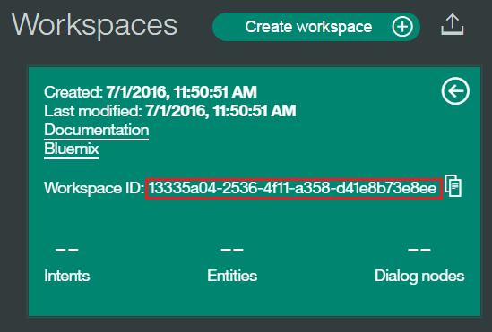

# SpeechToSpeech
# Speech to Speech Browser Application

  The application uses IBM's speech recognition and voice synthesis capabilities to use their voice to interact with the IBM Watson Conversation service.

Give it a try! Click the button below to fork into IBM DevOps Services and deploy your own copy of this application on Bluemix.

[](https://bluemix.net/deploy?repository=https://github.com/bodonova/SpeakToWatson)

## Getting Started

1. Create a Bluemix Account

    [Sign up][sign_up] in Bluemix, or use an existing account. Watson Services in Beta are free to use.

2. Download and install the [Cloud-foundry CLI][cloud_foundry] tool

3. Edit the `manifest.yml` file and change the `<application-name>` to something unique.
  ```none
---
declared-services:
  speech-to-text-service:
    label: speech_to_text
    plan: standard
  conversation-service:
    label: conversation
    plan: free
  text-to-speech-service:
    label: text_to_speech
    plan: standard
applications:
- name: <application name>
  command: node app.js
  buildpack: sdk-for-nodejs
  path: .
  memory: 256m
  services:
  - speech-to-text-service
  - conversation-service
  - text-to-speech-service
  ```
  The name you use will determinate your application url initially, e.g. `<application-name>.mybluemix.net`.

4. Install [Node.js](http://nodejs.org/)

5. Install project dependencies and build browser application:
  ```sh
  $ npm install
  $ npm build
  ```

6. Connect to Bluemix in the command line tool.
  ```sh
  $ cf api https://api.ng.bluemix.net
  $ cf login -u <your user ID>
  ```

7. Create the following three services in Bluemix.
  ```sh
  $ cf create-service speech_to_text standard speech-to-text-service
  $ cf create-service text_to_speech standard text-to-speech-service
  $ cf create-service conversation free conversation-service
  ```

8. Import the conversation from JSON as described in the [Workspace section of this document](Workspace)

9. Push it live!
  ```sh
  $ cf push
  ```
See the full [Getting Started][getting_started] documentation for more details, including code snippets and references.

## Running locally

  The application uses [Node.js](http://nodejs.org/) and [npm](https://www.npmjs.com/) so you will have to download and install them as part of the steps below.

1. Copy the credentials from your `speech-to-text-service-standard`, `language-translation-service`,
   `text-to-speech-service` services in Bluemix to `app.js`, you can see the credentials using:

    ```sh
    $ cf env <application-name>
    ```
    Example output:
    ```sh
    System-Provided:
    {
     "VCAP_SERVICES": {
      "AvailabilityMonitoring": [
       {
        "credentials": {
         "cred_url": "https://perfbroker.au-syd.bluemix.net",
         "token": "NGa4SdZyjRoQTyec7pj556Wy0EG3eTYju4dIoMtCOk3H7Fu3WNwojuE2e7A2Ikr4jfuG1b8tC/1hA+V05HRaVkT8rpyyiZm448WfvArq2Q8="
        },
        "label": "AvailabilityMonitoring",
        "name": "availability-monitoring-auto",
        "plan": "Lite",
        "provider": null,
        "syslog_drain_url": null,
        "tags": [
         "ibm_created",
         "bluemix_extensions",
         "dev_ops",
         "lite"
        ],
        "volume_mounts": []
       }
      ],
      "conversation": [
       {
        "credentials": {
         "password": "i4L4zzZjqTyg",
         "url": "https://gateway.watsonplatform.net/conversation/api",
         "username": "3a10f334-2963-42dd-a6bd-4b5da7d8573f"
        },
        "label": "conversation",
        "name": "conversation-service",
        "plan": "free",
        "provider": null,
        "syslog_drain_url": null,
        "tags": [
         "watson",
         "ibm_created",
         "ibm_dedicated_public",
         "lite"
        ],
        "volume_mounts": []
       }
      ],
      "speech_to_text": [
       {
        "credentials": {
         "password": "5rVjefqG8HZ7",
         "url": "https://stream.watsonplatform.net/speech-to-text/api",
         "username": "8ddd3fe6-746a-45fd-8fb2-a256ca165e76"
        },
        "label": "speech_to_text",
        "name": "speech-to-text-service",
        "plan": "standard",
        "provider": null,
        "syslog_drain_url": null,
        "tags": [
         "watson",
         "ibm_created",
         "ibm_dedicated_public"
        ],
        "volume_mounts": []
       }
      ],
      "text_to_speech": [
       {
        "credentials": {
         "password": "xPmMGOYh6kWn",
         "url": "https://stream.watsonplatform.net/text-to-speech/api",
         "username": "15af92b9-fbd4-4cbc-86da-9c839d022d81"
        },
        "label": "text_to_speech",
        "name": "text-to-speech-service",
        "plan": "standard",
        "provider": null,
        "syslog_drain_url": null,
        "tags": [
         "watson",
         "ibm_created",
         "ibm_dedicated_public"
        ],
        "volume_mounts": []
       }
      ]
     }
    }

    {
     "VCAP_APPLICATION": {
      "application_id": "05effa72-be64-4092-bf1f-4650c04f170b",
      "application_name": "speak-to-watson-app",
      "application_uris": [
       "speak-to-watson-app.au-syd.mybluemix.net"
      ],
      "application_version": "6b922803-d7d3-42b4-962f-ef048e3ed9b1",
      "cf_api": "https://api.au-syd.bluemix.net",
      "limits": {
       "disk": 1024,
       "fds": 16384,
       "mem": 256
      },
      "name": "speak-to-watson-app",
      "space_id": "2a12200a-4455-413d-8322-f82fab04307d",
      "space_name": "Australia",
      "uris": [
       "speak-to-watson-app.au-syd.mybluemix.net"
      ],
      "users": null,
      "version": "6b922803-d7d3-42b4-962f-ef048e3ed9b1"
     }
    }

    User-Provided:
    CONV_WORKSPACE_ID: f567d2bf-f5f6-46bc-9fa1-396b9d03cb90

    Running Environment Variable Groups:
    BLUEMIX_REGION: ibm:yp:au-syd

    Staging Environment Variable Groups:
    BLUEMIX_REGION: ibm:yp:au-syd
    ```
    You need to copy `lt-username`, `lt-password`, `stt-username`, `stt-password`, `tts-username` and `tts-password`.

2. Install [Node.js](http://nodejs.org/)

3. To install project dependencies, go to the project folder in a terminal and run:
    ```sh
    $ npm install
    ```

4. Then, build the browser application:

    ```sh
    $ npm build
    ```

5. Start the application:
    ```sh
    $ node app.js
    ```

6. Go to: [http://localhost:3000](http://localhost:3000)


<a name="workspace">
# Import a workspace
</a>

To use the app you're creating, you need to add a workspace to your Conversation service. A workspace is a container for all the artifacts that define the behavior of your service (ie: intents, entities and chat flows). For this sample app, you can either use a workspace you already have or use the car related workspace from the [Simple Conversation](https://github.com/watson-developer-cloud/conversation-simple) sample.

For more information on workspaces, see the full  [Conversation service  documentation](https://www.ibm.com/smarterplanet/us/en/ibmwatson/developercloud/doc/conversation/overview.shtml).

1 Navigate to the Bluemix dashboard, select the Conversation service that you created.

2 Go to the **Manage** menu item and select **Launch Tool**. This opens a new tab in your browser, where you are prompted to login if you have not done so before. Use your Bluemix credentials.

3 If you are deploying through Bluemix, download the [exported JSON file](https://raw.githubusercontent.com/bodonova/SpeakToWatson/master/car_weather_workspace.json)
[exported JSON file](https://raw.githubusercontent.com/doconnor78/conversation-simple-weather/master/training/car_weather_workspace.json) that contains the Workspace contents. If deploying locally,  this was cloned and is in the root folder (car_workspace.json).

4 Select the import icon: . Browse to (or drag and drop) the JSON file. Choose to import **Everything(Intents, Entities, and Dialog)**. Then select **Import** to finish importing the workspace.

5 Refresh your browser. A new workspace tile is created within the tooling. Select the _menu_ button within the workspace tile, then select **View details**:

&nbsp;&nbsp;&nbsp;&nbsp;&nbsp;&nbsp;&nbsp;&nbsp;&nbsp;&nbsp;&nbsp;&nbsp;

<a name="workspaceID">
In the Details UI, copy the 36 character UNID **ID** field. This is the **Workspace ID**.
</a>

&nbsp;&nbsp;&nbsp;&nbsp;&nbsp;&nbsp;&nbsp;&nbsp;&nbsp;&nbsp;&nbsp;&nbsp; 

6 Return to the deploy steps that you were following:
- For Local - [return to step 2](#returnlocal)
- For Bluemix - [return to step 5](#returnbluemix)

<a name="env">
# Adding environment variables in Bluemix
</a>

1 In Bluemix, open the application from the Dashboard. Select **Environment Variables**.

2 Select **USER-DEFINED**.

3 Select **ADD**.

4 Add a variable with the name **WORKSPACE_ID**. For the value, paste in the Workspace ID you [copied earlier](#workspaceID). Select **SAVE**.

&nbsp;&nbsp;&nbsp;&nbsp;&nbsp;&nbsp;&nbsp;&nbsp;&nbsp;&nbsp;&nbsp;&nbsp;

5 Restart your application.


## Troubleshooting

To troubleshoot your Bluemix app the main useful source of information are the logs, to see them, run:

  ```sh
  $ cf logs <application-name> --recent
  ```

## License

  This sample code is licensed under Apache 2.0. Full license text is available in [LICENSE](LICENSE).

## Contributing

  See [CONTRIBUTING](CONTRIBUTING.md).

## Open Source @ IBM
  Find more open source projects on the [IBM Github Page](http://ibm.github.io/)

[cloud_foundry]: https://github.com/cloudfoundry/cli
[getting_started]: http://www.ibm.com/smarterplanet/us/en/ibmwatson/developercloud/doc/getting_started/
[sign_up]: https://apps.admin.ibmcloud.com/manage/trial/bluemix.html?cm_mmc=WatsonDeveloperCloud-_-LandingSiteGetStarted-_-x-_-CreateAnAccountOnBluemixCLI
